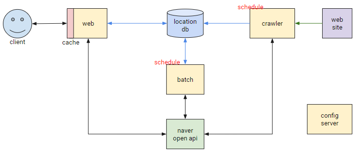
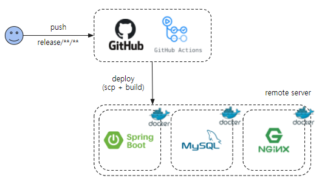

# tasty-food-seeker
맛있는 음식점을 찾아라

## 개요
서울시 업무추진비로 이용하는 음식점은 어디어디가 있을까?

## 시스템 구성도

## 인프라 구성도

* github action 에서는 애플리케이션 빌드 및 리모트 서버로 배포를 수행한다.
    * 배포 시 리모트서버에 단일 도커 컨테이너로 프로세스가 올라간다.
    * 따로 클러스터링은 되어있지 않은 상태이다. 
